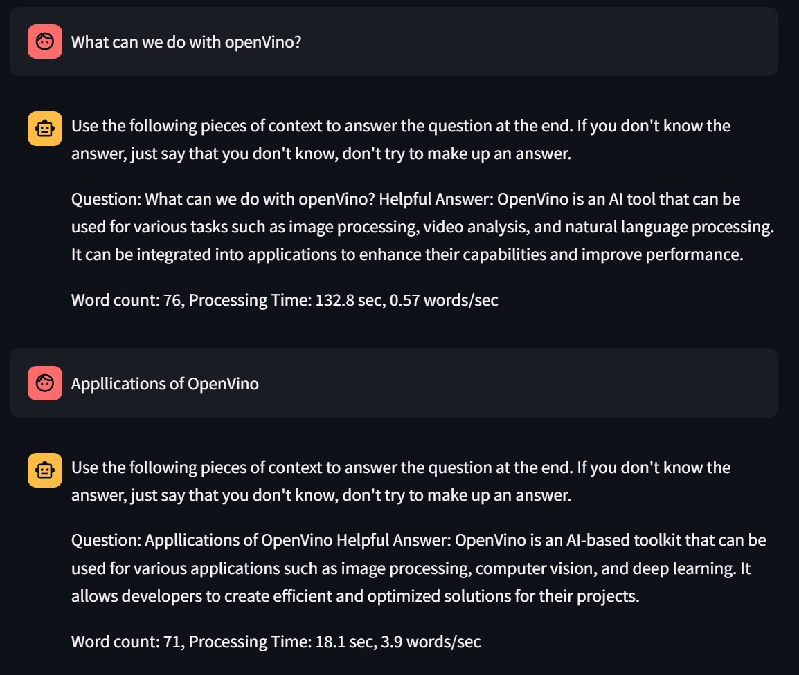

# OpenVino_Chatbot

## Overview
OpenVino_Chatbot is a Q&A Chatbot designed to answer questions related to OpenVINO web documentation. It leverages the power of Intel OpenVINO to run Generative AI models on Intel AI Laptops, providing simple LLM inference on CPU and enabling fine-tuning of LLM models. The chatbot can operate completely offline once the necessary data and models are prepared locally, making it an efficient solution without reliance on cloud services or web APIs.

## Features
- **Offline Inference**: Perform all inferencing offline without the need for cloud services.
- **Model Support**: Supports downloading and converting models like neural-chat-7b and llama2-7b to OpenVINO IR models.
- **Documentation Extraction**: Converts OpenVINO HTML documents into a vector store for efficient querying.
- **Streamlit Client**: User-friendly client interface built with Streamlit for interacting with the chatbot.

## Installation and Setup

### 1. Create a Virtual Environment
```sh
python -m venv venv
source venv/bin/activate  # On Windows use `venv\Scripts\activate`
```

### 2. Install Requirements
```sh
python -m pip install -U pip
pip install -U setuptools wheel
pip install -r requirements.txt
python -m spacy download en_core_web_sm
```

### 3. Download Documentation
You can download the documentation manually or use BeautifulSoup. Save the contents in the `files_html_doc` directory. After downloading, run:
```sh
python openvino-doc-specific-extractor.py
```

### 4. Download the Models
Download the neural-chat-7b or llama2-7b models from Hugging Face. Run the following script to download and convert them to OpenVINO IR models:
```sh
python llm-2model-download.py
```

### 5. Run the Server
Start the OpenVINO Q&A server:
```sh
uvicorn openvino-server:app --host 0.0.0.0
```

### 6. Run the Client
Launch the Streamlit client:
```sh
streamlit run openvino-client.py
```

## Programs / Files

| # | Program/File                  | Description                                                         |
|---|-------------------------------|---------------------------------------------------------------------|
| 1 | `llm-2model-download.py`      | Download and convert neural-chat-7b and llama2-7b-chat models.      |
| 2 | `openvino-doc-specific-extractor.py` | Convert OpenVINO HTML documents into a vector store (DB).         |
| 3 | `openvino-server.py`          | OpenVINO Q&A server.                                                |
| 4 | `openvino-client.py`          | OpenVINO Q&A client.                                                |
| 5 | `.env`                        | Configuration file.                                                 |
| 6 | `requirements.txt`            | Python module requirements file.                                    |
| 7 | `huggingface_login.py`        | Script to login to Hugging Face hub.                                |

## Example


## Contributing
Contributions are welcome! Please feel free to submit a Pull Request or open an issue for any bugs, improvements, or suggestions.

## License
This project is licensed under the MIT License. See the [LICENSE](LICENSE) file for details.

## Acknowledgments
- Intel OpenVINO
- Hugging Face
- Streamlit

For more information, visit the [OpenVINO official website](https://docs.openvino.ai/latest/index.html).

